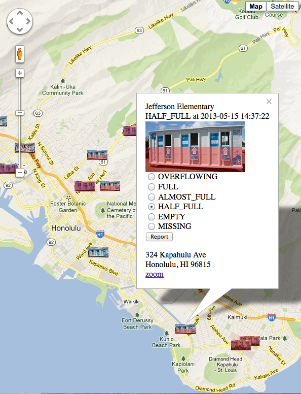

drop-off-bins
=============

Honolulu's [big, white, multi-material drop-off bins](http://www.opala.org/solid_waste/multi_material_recycling_center_locations.html)
are often full when I go try to drop off my recycling.
This web app will help recyclers find ones that are not full,
and help the management company schedule efficient pick-ups,
with a map for sharing status reports.

Technologies
------------

I am trying out some that are new to me.

* Google Maps API v.3
* Grails 2.2.0 (because Heroku said it cannot handle 2.2.2)
* PostgreSQL 9.1, because
  * Heroku does not support MySQL (just PostgreSQL 9.0, 9.1, and 9.2 now), and
  * the PostgreSQL 9.2 driver in Maven Central [is said to not support Java 6](https://github.com/pgjdbc/pgjdbc/issues/46)
* Heroku Grails plugin

To do
-----

* redirect the app's index to the map
* add notes to infowindow (pick-up schedules?)
* fix the "zoom" JavaScript
* report via AJAX
* load fixtures in bootstrap only if db is empty
* get running on Heroku (or try on CloudFoundry?)
* test on mobile
* display time relatively (user-friendly, color-code by freshness?)
* add expansion of report history detail
* show to the management company
* reduce number of status (just full or not full)?
  * need missing too?  can distinguish from not knowing where the bin is?
  * handle missing with support email (out of band), like location changes?
* simplify icons?
* save report GeoLocation (if any, for some anonymous validation)?
* add page with captcha to send support email
* add info about what can be recycled, who is managing the bins now, etc
* initially zoom map based on client's GeoLocation?
* admin login for CRUD?
* management login for special reports?
  * report groups of bins as empty in one step?
  * automatic schedules to report bins as empty?
  * give greater assurance to reports by management?
* allow sign up for various report notifications via email?
  * general user logins too?
  * any way to do free SMS too?
  * monitor certain groups of bins for certain status
* update to Java 7, Postgres 9.2, and/or Grails 2.2.2 (or later)
